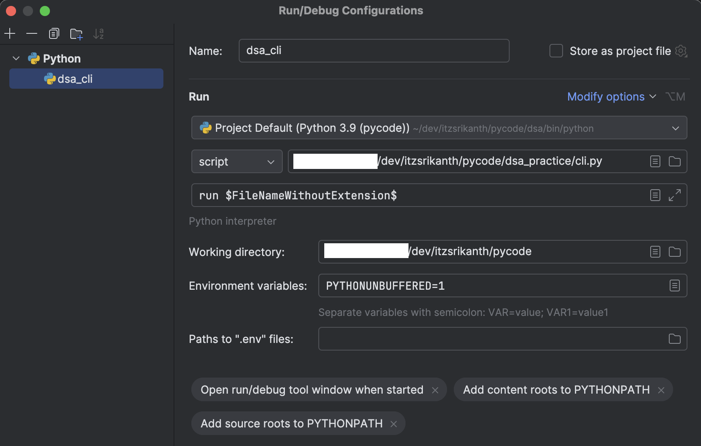

# 🚀 DSA Practice Setup Guide

## **Python Equivalents of Husky (Node.js)**

### **1. Pre-commit Hooks (Most Similar to Husky)**
```bash
# Install pre-commit hooks (like husky install)
pip install pre-commit
pre-commit install

# Run hooks on all files (like husky pre-commit)
pre-commit run --all-files
```

### **2. Automatic CLI Installation**
```bash
# One-time setup (like husky install)
python setup.py

# Or use Makefile (like npm scripts)
make setup
```

### **3. Virtual Environment Scripts**
```bash
# Create and setup virtual environment
source setup_venv.sh

# Or use Makefile
make venv
```

## **🔧 Setup Options**

### **Option 1: Quick Setup (Recommended)**
```bash
# Clone repository
git clone <repository-url>
cd pycode

# Run setup script
python setup.py

# Start using CLI
dsa --help
```

### **Option 2: Manual Setup**
```bash
# Clone repository
git clone <repository-url>
cd pycode

# Install in development mode
pip install -e .

# Install pre-commit hooks
pip install pre-commit
pre-commit install

# Verify installation
dsa --help
```

### **Option 3: Virtual Environment Setup**
```bash
# Clone repository
git clone <repository-url>
cd pycode

# Create virtual environment
python3 -m venv venv

# Activate virtual environment
source venv/bin/activate  # On Windows: venv\Scripts\activate

# Install DSA CLI
pip install -e .

# Install pre-commit hooks
pip install pre-commit
pre-commit install
```

### **Option 4: Using Makefile (Like npm scripts)**
```bash
# Clone repository
git clone <repository-url>
cd pycode

# Complete setup
make setup

# Or step by step
make venv
source venv/bin/activate
make dev-install
```

## **🐞 Debuggging**


## **📁 Virtual Environment Handling**

### **✅ What to EXCLUDE from Git (Already in .gitignore)**
```
# Virtual environments
venv/
.venv/
env/
.env/
ENV/
env.bak/
venv.bak/

# Python cache
__pycache__/
*.pyc
*.pyo
*.pyd

# IDE files
.vscode/
.idea/
*.swp
*.swo

# OS files
.DS_Store
Thumbs.db
```

### **✅ What to INCLUDE in Git**
```
# Package configuration
pyproject.toml
setup.py
requirements.txt

# Source code
dsa_practice/
solutions/
utils/
tests/

# Configuration files
.pre-commit-config.yaml
pytest.ini
.gitignore
Makefile

# Documentation
README.md
CLI_USAGE_GUIDE.md
SETUP_GUIDE.md
```

## **🎯 Pre-commit Hooks (Like Husky)**

### **Automatic Hooks on Git Commit**
```bash
# Install hooks (run once)
pre-commit install

# Now every commit will automatically:
# 1. Format code with black
# 2. Run linting with flake8
# 3. Check types with mypy
# 4. Run security checks with bandit
# 5. Sort imports with isort
# 6. Install DSA CLI if not present
```

### **Manual Hook Execution**
```bash
# Run all hooks on all files
pre-commit run --all-files

# Run specific hook
pre-commit run black
pre-commit run flake8
pre-commit run mypy
```

## **🔧 Development Workflow**

### **1. First Time Setup**
```bash
# Clone and setup
git clone <repository-url>
cd pycode
python setup.py

# Verify
dsa --help
```

### **2. Daily Development**
```bash
# Activate virtual environment (if using venv)
source venv/bin/activate

# Create new solution
dsa create 1 two-sum

# Edit solution
dsa edit 0001.two_sum

# Run solution
dsa run 0001.two_sum

# Test solution
dsa test 0001.two_sum

# Commit changes (hooks run automatically)
git add .
git commit -m "Add Two Sum solution"
```

### **3. Team Collaboration**
```bash
# Clone repository
git clone <repository-url>
cd pycode

# Setup development environment
make setup

# Start developing
dsa create 2 add-two-numbers
```

## **📦 Package Management**

### **Development Dependencies**
```bash
# Install all dependencies
pip install -e .

# Install development tools
pip install pre-commit black flake8 mypy

# Install pre-commit hooks
pre-commit install
```

### **Production Dependencies**
```bash
# Install only runtime dependencies
pip install -e . --no-dev
```

## **🚀 CI/CD Integration**

### **GitHub Actions Example**
```yaml
name: DSA Practice CI
on: [push, pull_request]

jobs:
  test:
    runs-on: ubuntu-latest
    steps:
      - uses: actions/checkout@v3
      - uses: actions/setup-python@v4
        with:
          python-version: '3.8'
      - run: pip install -e .
      - run: dsa list
      - run: python -m pytest tests/
```

## **🎉 Benefits**

### **1. Automatic Setup**
- ✅ **One command setup** like `npm install`
- ✅ **Pre-commit hooks** like Husky
- ✅ **Automatic CLI installation**
- ✅ **Development environment ready**

### **2. Team Collaboration**
- ✅ **Consistent environment** across team
- ✅ **Automatic code formatting** on commit
- ✅ **Linting and type checking** before commit
- ✅ **Easy onboarding** for new developers

### **3. Development Experience**
- ✅ **Makefile commands** like npm scripts
- ✅ **Rich CLI interface** with colors and tables
- ✅ **Comprehensive help** and error messages
- ✅ **Easy solution management**

## **🔍 Troubleshooting**

### **Common Issues**

1. **CLI not found after installation**
   ```bash
   # Reinstall in development mode
   pip install -e .
   
   # Check installation
   which dsa
   dsa --version
   ```

2. **Pre-commit hooks not working**
   ```bash
   # Reinstall hooks
   pre-commit uninstall
   pre-commit install
   
   # Run manually
   pre-commit run --all-files
   ```

3. **Virtual environment issues**
   ```bash
   # Recreate virtual environment
   rm -rf venv
   python3 -m venv venv
   source venv/bin/activate
   pip install -e .
   ```

## **📚 Next Steps**

1. **Run setup**: `python setup.py`
2. **Create solution**: `dsa create 1 two-sum`
3. **Start coding**: `dsa edit 0001.two_sum`
4. **Run solution**: `dsa run 0001.two_sum`
5. **Commit changes**: `git add . && git commit -m "Add solution"`

The setup is now **fully automated** and **team-ready**! 🎯
